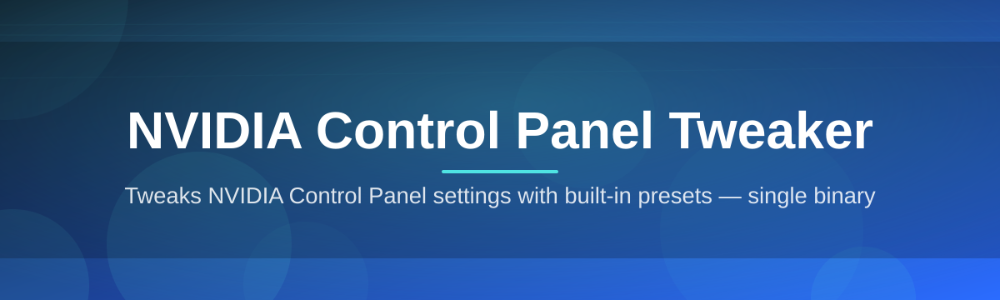
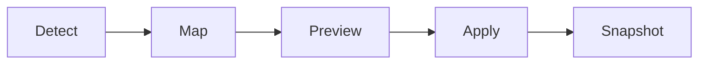

# nvidia-control-panel-optimizer 🎛️⚡

  

*The control panel NVIDIA forgot to build — tuned, visual, and actually fun to use.*

## 📖 Overview

<b>One bold sentence, then the whole story — click to expand</b>

 

**This project exists because the stock NVIDIA Control Panel hasn't meaningfully evolved in a decade, and every gamer, streamer, and creator deserves better than nested dropdown menus from 2013.**

I started `nvidia-control-panel-optimizer` as a weekend itch-scratch: I was sick of digging six menus deep just to flip anisotropic filtering or check my driver's power management mode. What began as a personal utility to sit on top of the native driver settings turned into a full rethink of how GPU tuning *should* feel — visual, immediate, and honest about what each slider actually does to your frame times.

This tool is for the 144Hz chaser trying to squeeze out every last frame, the color-accuracy nerd calibrating gamma curves for editing, and the everyday user who just wants their fans quieter without diving into vBIOS territory. It reads and organizes the same underlying NVIDIA driver settings you already have access to — just laid out the way a control panel should be in 2026: fast, legible, and built around *your* workflow instead of NVIDIA's internal engineering org chart.

> [!NOTE]
> This is an independent, community-built companion for the NVIDIA Control Panel. It is not affiliated with or endorsed by NVIDIA Corporation.

  

---

## 🚀 What It Actually Does

  

- **One-Click Profile Switching** — jump between "Competitive," "Cinematic," and "Silent Room" presets without touching a single native slider by hand.

- **Live Frame-Time Overlay Preview** — see a ghost preview of how a setting change *tends* to affect frame consistency before you commit to it.

- **Driver Setting Deep Search** — type "sharpen" or "vsync" and get taken directly to the buried control, no menu archaeology required.

- **Fan Curve Sandbox** — visually draw a custom fan curve against temperature, instead of typing numbers into tiny boxes.

- **Color & Gamma Calibration Assistant** — walks you through a guided calibration pass with side-by-side before/after swatches.

- **Multi-Monitor Profile Memory** — remembers different optimization profiles per display, so your ultrawide and your OLED don't fight over settings.

- **Export & Import Configs** — package your tuned setup into a single shareable file for a new rig or a friend's build.

- **Rollback Snapshot** — every change is snapshotted so you can undo an entire tuning session in one click, not fifteen.

---

## 🏁 Up and Running

> [!TIP]
> The whole setup takes less time than one loading screen in a modern AAA title.

1. **Visit the landing page** using the download button below — that's the only official source.

2. **Grab the latest build** for Windows 10 or 11 (x64).

3. **Run the executable** — no installer wizard, no background services, no reboot required.

4. **Launch, scan, tune** — the app auto-detects your GPU and current driver settings on first open.

  

---

## 💻 System Requirements

| Component | Minimum | Recommended |
|---|---|---|
| OS | Windows 10 (64-bit) | Windows 11 (64-bit) |
| GPU | Any NVIDIA GPU with current drivers | RTX-series GPU |
| Dependencies | None — fully standalone | None |
| Disk Space | ~40 MB | ~40 MB |
| Admin Rights | Recommended for full setting access | Recommended |

> [!IMPORTANT]
> Make sure your NVIDIA driver is up to date before launching. The tweaker reads live driver state — an outdated driver means outdated (or missing) settings.

---

## ⚙️ How It Works

The app doesn't reinvent your GPU driver — it becomes a smarter lens over it. Here's the flow, start to finish:

1. **Detection** — the tool scans your installed NVIDIA driver and enumerates every exposed control it can see.

2. **Mapping** — raw driver values are translated into human-readable sliders, toggles, and curves.

3. **Preview** — your intended change is simulated visually before being written anywhere.

4. **Apply** — confirmed changes are written back through the same official driver API layer the native panel uses.

5. **Snapshot** — a rollback point is saved automatically, so nothing is ever a one-way street.

---

## 🧩 Troubleshooting

<b>The app says "No NVIDIA GPU detected" but I definitely have one.</b>

 

Update your driver through NVIDIA's official channel first — some very old driver branches don't expose the metadata the tweaker relies on to enumerate settings.

<b>My fan curve changes don't seem to stick after a restart.</b>

 

Custom fan curves live in a profile file, not the driver's persistent memory. Make sure "Apply on startup" is enabled in Settings → Persistence.

<b>Can I run this alongside GeForce Experience or the standard Control Panel?</b>

 

Yes. It reads and writes through the same driver layer, so it plays nicely alongside NVIDIA's own tools — just avoid changing the same setting in both at the exact same moment.

<b>My rollback snapshot didn't restore everything.</b>

 

Snapshots capture driver-exposed settings only. Anything changed at a firmware or vBIOS level (rare, and not something this tool touches) falls outside snapshot scope.

<b>Colors look oversaturated after using the calibration assistant.</b>

 

Run the assistant again in a properly lit room — ambient light heavily skews the guided gamma steps. You can also reset just the color profile from Settings → Reset Section.

> [!WARNING]
> Extreme fan curve settings (very low RPM at high temps) can cause thermal throttling. The sandbox will warn you visually, but always sanity-check curves against your case airflow.

---

## 🎨 UI / UX Details

| Feature | Detail |
|---|---|
| Themes | Dark, Light, and "Midnight GPU" high-contrast |
| Keyboard Shortcut — Quick Profile Switch | `Ctrl + Shift + P` |
| Keyboard Shortcut — Open Search | `Ctrl + F` |
| Keyboard Shortcut — Snapshot Now | `Ctrl + S` |
| Keyboard Shortcut — Undo Last Change | `Ctrl + Z` |
| Layout | Resizable panels, per-monitor scaling aware |
| Accessibility | Full keyboard navigation, colorblind-safe curve editor palette |

> [!TIP]
> Hold `Alt` while dragging any slider for fine-grained, sub-increment adjustments — great for gamma and sharpening curves.

---

## 🤝 Contributing & Community

This started as a passion project, and it stays alive because people keep showing up with ideas, bug reports, and the occasional beautifully unhinged feature request.

- Open an issue for bugs, oddities, or driver-edge-cases you hit.

- Discussions tab is open for preset sharing and "what did you tune" show-and-tell.

- Pull requests are welcome — please keep changes scoped and describe the *why*, not just the *what*.

> [!NOTE]
> No formal roadmap gatekeeping here — if a feature makes sense and fits the project's spirit, it has a real shot at getting merged.

---

## 📜 License

Released under the [MIT License](LICENSE), 2026. Use it, fork it, tune your rig into oblivion.

---

## ⚠️ Disclaimer

This tool is an independent, community-driven project and is **not affiliated with, endorsed by, or sponsored by NVIDIA Corporation**. All trademarks belong to their respective owners. Modifying GPU settings — even through official driver APIs — carries inherent risk; use snapshots, go slow with fan curves, and always keep your drivers current.

  

